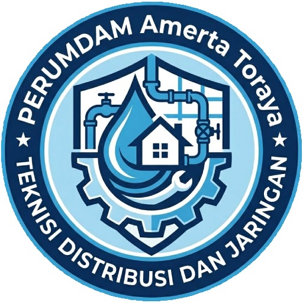

  
  <h1>📝 Distribusi</h1>
  
<b>Sistem Dokumentasi Kinerja Digital Teknisi Distribusi dan Jaringan</b>

  

    
    
    
  

---

### 📖 Deskripsi Proyek
**LaporDok** adalah blueprint aplikasi web *Progressive Web App* (PWA) yang dirancang untuk membantu teknisi lapangan dalam melakukan pelaporan hasil kerja secara digital. Aplikasi ini berfokus pada validitas data menggunakan fitur kamera berbasis lokasi (GPS) untuk memastikan setiap pekerjaan terdokumentasi dengan akurat.

---

### ✨ Fitur Unggulan

<table>
  <tr>
    <td><b>📸 Smart Watermark</b></td>
    <td>Kamera otomatis menyematkan peta satelit, koordinat GPS, alamat presisi, serta tanggal/waktu pada foto.</td>
  </tr>
  <tr>
    <td><b>🛠️ Integrasi SOP</b></td>
    <td>Daftar pekerjaan sudah disesuaikan dengan indikator kinerja teknis resmi perusahaan.</td>
  </tr>
  <tr>
    <td><b>💾 Local Persistence</b></td>
    <td>Sistem draf otomatis. Data tersimpan di memori browser, aman dari gangguan sinyal saat pengisian.</td>
  </tr>
  <tr>
    <td><b>🖨️ Cetak Siap Pakai</b></td>
    <td>Fitur ekspor ke format cetak A4 yang rapi untuk lampiran Laporan Kinerja Harian (LKH).</td>
  </tr>
  <tr>
    <td><b>📱 Mobile First</b></td>
    <td>Desain responsif yang ringan dan dapat diinstal di layar utama HP (PWA).</td>
  </tr>
</table>

---

### 🛠️ Teknologi yang Digunakan

| Komponen | Teknologi |
| :--- | :--- |
| **Bahasa Utama** | HTML5, CSS3, JavaScript (ES6) |
| **Pemetaan** | OpenStreetMap & Yandex Maps API |
| **Ikon** | Emoji & Custom CSS |
| **Storage** | Browser LocalStorage API |
| **Deployment** | GitHub Pages / Web Hosting |

---

### 📂 Struktur Blueprint
Aplikasi ini dibangun dengan arsitektur yang sangat ringan tanpa memerlukan database server (Serverless):
- `index.html` : Antarmuka input laporan dan logika kamera.
- `tampildata.html` : Manajemen riwayat, filter data, dan sistem cetak.
- `manifest.json` : Konfigurasi instalasi aplikasi di perangkat.
- `sw.js` : Service Worker untuk mendukung fungsionalitas PWA.

---

### 🚀 Cara Penggunaan

1. **Instalasi**: Buka tautan aplikasi di Chrome (Android) atau Safari (iOS), lalu pilih **"Add to Home Screen"**.
2. **Pengambilan Foto**: Klik ikon kamera, pastikan izin lokasi diberikan. Tunggu indikator GPS menjadi hijau sebelum memotret.
3. **Penyusunan**: Tambahkan item pekerjaan sebanyak yang diperlukan dalam satu laporan harian.
4. **Finalisasi**: Simpan data, kemudian masuk ke menu **Riwayat** untuk mencetak laporan menjadi PDF atau dokumen fisik.

---

### 📋 Indikator Pekerjaan (SOP)
Aplikasi ini mencakup pelaporan untuk:
- Distribusi air wilayah pelayanan.
- Pengawasan kontinuitas aliran pelanggan.
- Pemeliharaan *gate valve, air valve,* dan *wash out*.
- Perbaikan kebocoran pipa distribusi & SR.
- Penanganan aduan sistem SIMPEL.
- Input data aduan mandiri lapangan.

---

  
<b>Developed with ❤️ for Tim Distribusi</b>

  Blueprint v1.0 - Digitalisasi Teknisi Lapangan

